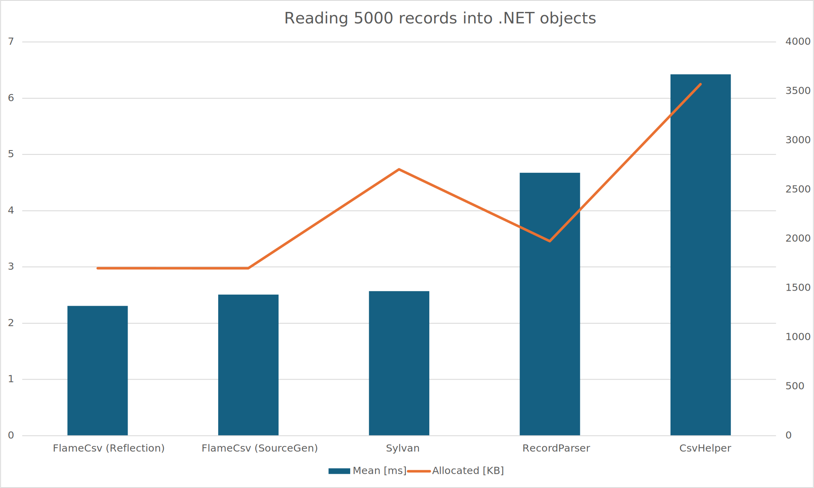
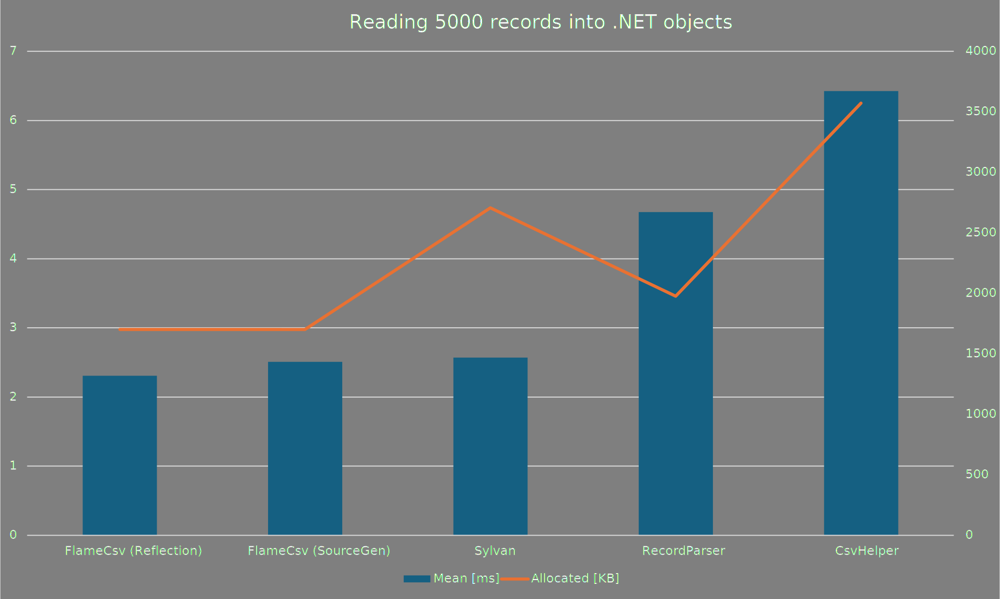
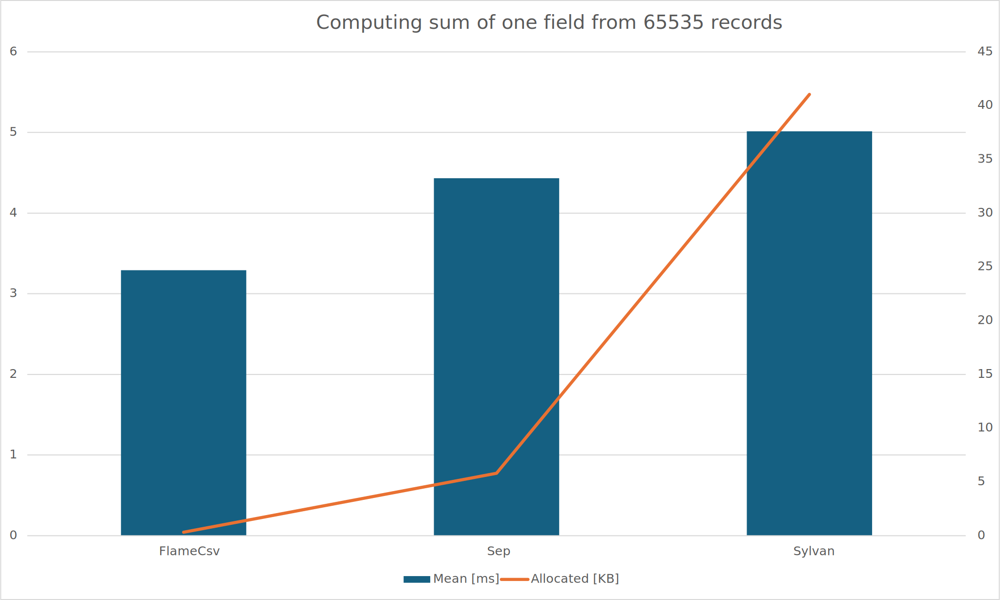
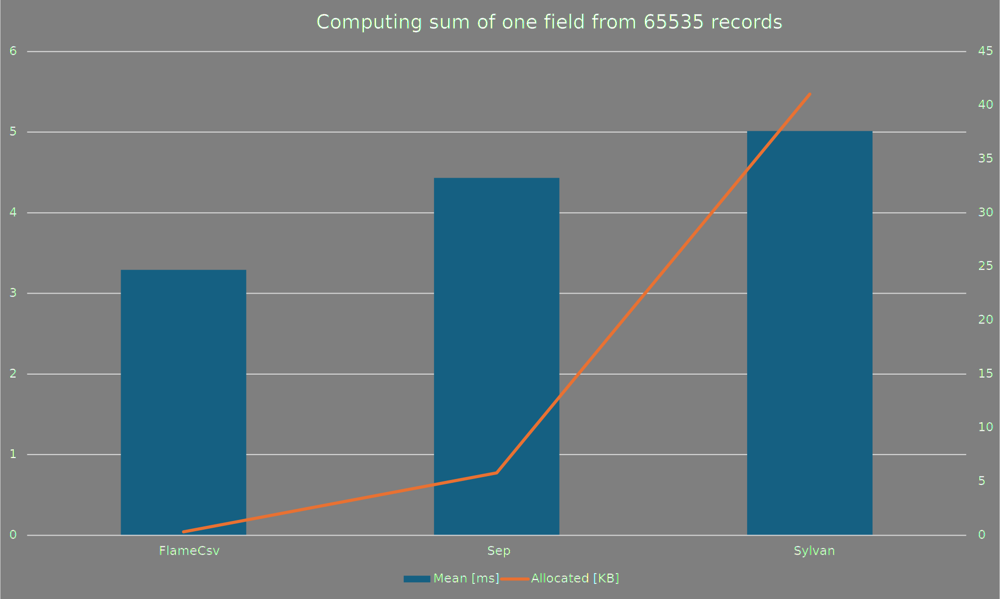
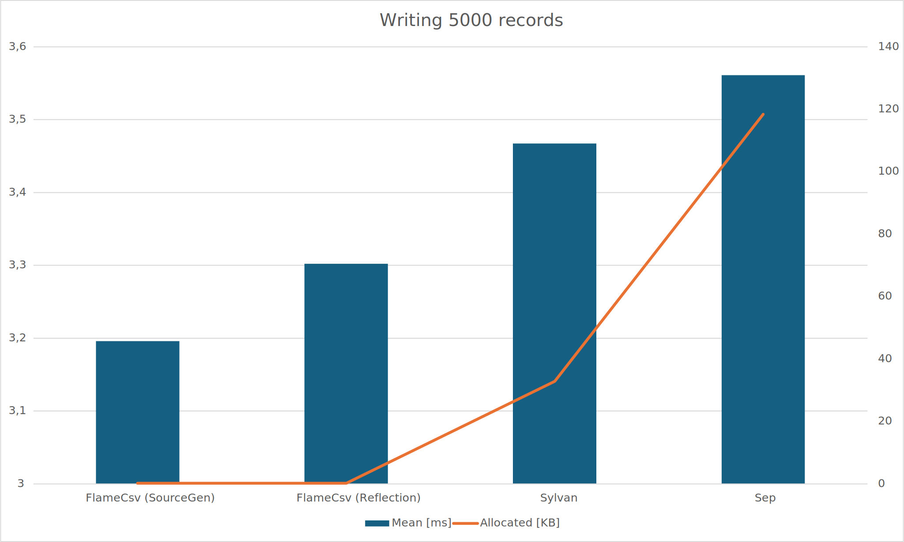
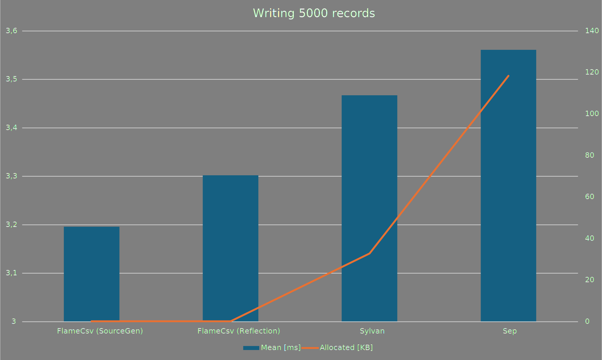
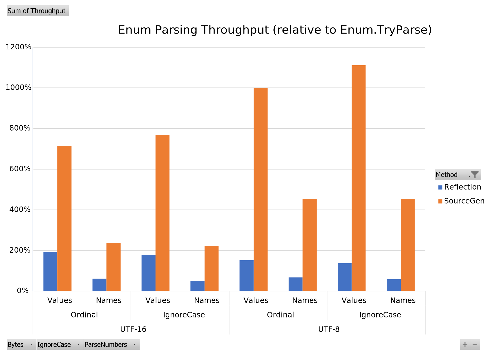
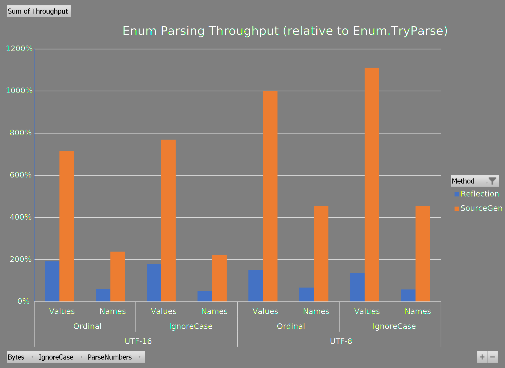
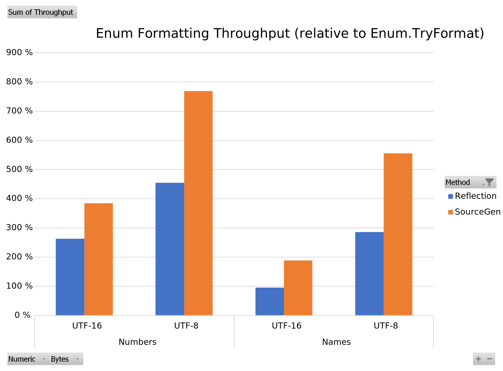
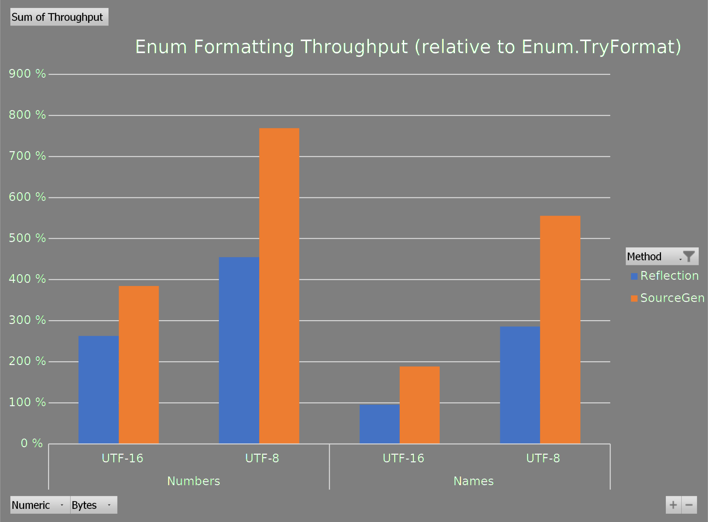

# Benchmarks

This page contains benchmarks comparing the performance of FlameCsv with other popular CSV libraries.
Some libraries lack async support for all/any operations, or they have profound feature gaps in certain workloads. These are noted where applicable.

The benchmarks use varied sample CSV datasets, and can be downloaded from the repository.

> TODO: commit where datasets are stored and benchmark code was run

> ![NOTE]
> AVX-512 benchmarks will be added if I can get a suitable CPU for testing.
> An older version of FlameCsv could tokenize a 8.2MB CSV file in 688.8 μs (at nearly 12 GB/s) single threaded.

## Results

### Reading .NET objects

The dataset is 5000 records of 10 fields of varied data, quoted fields, and escaped quotes.
The data is read from a pre-loaded byte array to simulate real-world scenarios.

| Method                | Mean     |  Ratio | Allocated | Alloc Ratio |
|----------------------:|---------:|-------:|----------:|------------:|
| FlameCsv (Reflection) | 2.308 ms |   1.00 |   1.66 MB |        1.00 |
| FlameCsv (SourceGen)  | 2.506 ms |   1.09 |   1.66 MB |        1.00 |
| Sylvan                | 2.570 ms |   1.11 |   2.64 MB |        1.59 |
| RecordParser          | 4.673 ms |   2.02 |   1.93 MB |        1.16 |
| CsvHelper             | 6.424 ms |   2.78 |   3.49 MB |        2.10 |

> Sep does not support binding to .NET objects.

### Reading without processing all fields

The dataset is 65535 records of 14 fields (no quotes or escapes). The benchmark calculates the sum of a single numerical field.
The data is read from a pre-loaded byte array.

| Method        | Mean      | Ratio | Allocated | Alloc Ratio |
|--------------:|----------:|------:|----------:|------------:|
| FlameCsv      |  3.292 ms |  1.00 |     322 B |        1.00 |
| Sep           |  4.431 ms |  1.35 |    5942 B |       18.45 |
| Sylvan        |  5.014 ms |  1.52 |   42029 B |      130.52 |
| RecordParser  |  6.358 ms |  1.93 | 2584418 B |    8,026.14 |
| CsvHelper     | 34.877 ms | 10.60 | 2789195 B |    8,662.10 |

### Writing .NET objects

The same dataset of 5000 records as above is written to @"System.IO.TextWriter.Null?displayProperty=nameWithType".
The objects are pre-loaded to an array.

| Method                | Mean     | Ratio | Allocated | Alloc Ratio |
|----------------------:|---------:|------:|----------:|------------:|
| FlameCsv (SourceGen)  | 3.196 ms |  1.00 |     170 B |        1.00 |
| FlameCsv (Reflection) | 3.302 ms |  1.03 |     174 B |        1.02 |
| Sylvan                | 3.467 ms |  1.08 |   33605 B |      197.68 |
| Sep                   | 3.561 ms |  1.11 |  121181 B |      712.83 |
| CsvHelper             | 7.806 ms |  2.44 | 2077347 B |   12,219.69 |
| RecordParser          | 9.245 ms |  2.89 | 8691788 B |   51,128.16 |

> Note that the Y axis for "Mean" doesn't start from 0 in this chart (this is Excel's default behavior for this dataset)

### Async

Here are the reading benchmarks using async overloads (where available). The test setup is same as before (no actual IO is done),
is meant to demonstrate the overhead of async versions.

Writing benchmarks are not included as they are expected to not be significantly different from the synchronous versions
(IO should only happen when flushing).

#### Reading .NET objects

| Method                | Mean     | Ratio | Allocated | Alloc Ratio |
|----------------------:|---------:|------:|----------:|------------:|
| FlameCsv (Reflection) | 2.307 ms |  1.00 |   1.66 MB |        1.00 |
| FlameCsv (SourceGen)  | 2.408 ms |  1.04 |   1.66 MB |        1.00 |
| Sylvan                | 2.891 ms |  1.25 |   2.65 MB |        1.59 |
| CsvHelper             | 6.672 ms |  2.89 |    3.5 MB |        2.11 |

#### Reading without processing all fields

| Method     | Mean      | Ratio | Allocated | Alloc Ratio |
|-----------:|----------:|------:|----------:|------------:|
| FlameCsv   |  3.771 ms |  1.00 |     632 B |        1.00 |
| Sep        |  4.764 ms |  1.26 |    5944 B |        9.41 |
| Sylvan     |  6.408 ms |  1.70 |   78102 B |      123.58 |
| CsvHelper  | 36.902 ms |  9.79 | 2935048 B |    4,644.06 |

### Enums

FlameCsv provides a [source generator](source-generator.md#enum-converter-generator) for enum converters that generates
highly optimized read/write operations specific to the enum. The comparisons below are performance relative to
`Enum.TryParse` or `Enum.TryFormat`.

Generating the enum converter at compile-time allows the enum to be analyzed, and specific optimizations to be made
regarding different values and names.
The generated converter especially excels at small enums that start from 0 without any gaps, and have only ASCII
characters in their name. More complex configurations such as flags and non-ASCII display names are supported as well.

The benchmarks below are for the `System.TypeCode`-enum, either in UTF8 (`byte`) or UTF16 (`char`).
You can find the generated code for the enum under [Source Generator](source-generator.md#enum-converter-generator).
Benchmarked on AMD Ryzen 7 3700X.

#### Parsing

The chart shows relative throughput of parsing enums using the reflection-based converter in FlameCsv,
and the source-generated converter (`Enum.TryParse` is the baseline at 100%). Higher is better.

<strong>Click to view benchmark summary</strong>

| Parameter | Description |
| ---------- | ------------ |
| Bytes | Parsing from UTF8 (`byte`) or UTF16 (`char`) |
| IgnoreCase | Parsing is case-insensitive |
| ParseNumbers | Input is numeric and not enum names |

| Method     | Bytes | IgnoreCase | ParseNumbers | Mean      | StdDev    | Ratio |
|----------- |------ |----------- |------------- |----------:|----------:|------:|
| TryParse   | False | False      | False        | 582.33 ns |  3.088 ns |  1.00 |
| Reflection | False | False      | False        | 300.89 ns |  0.340 ns |  0.52 |
| SourceGen  | False | False      | False        |  79.76 ns |  1.273 ns |  0.14 |
|            |       |            |              |           |           |       |
| TryParse   | False | False      | True         | 185.49 ns |  2.101 ns |  1.00 |
| Reflection | False | False      | True         | 304.56 ns |  2.484 ns |  1.64 |
| SourceGen  | False | False      | True         |  78.30 ns |  0.701 ns |  0.42 |
|            |       |            |              |           |           |       |
| TryParse   | False | True       | False        | 661.59 ns |  6.298 ns |  1.00 |
| Reflection | False | True       | False        | 369.34 ns |  3.516 ns |  0.56 |
| SourceGen  | False | True       | False        |  82.75 ns |  1.265 ns |  0.13 |
|            |       |            |              |           |           |       |
| TryParse   | False | True       | True         | 186.26 ns |  1.584 ns |  1.00 |
| Reflection | False | True       | True         | 368.88 ns |  3.205 ns |  1.98 |
| SourceGen  | False | True       | True         |  83.87 ns |  1.198 ns |  0.45 |
|            |       |            |              |           |           |       |
| TryParse   | True  | False      | False        | 726.99 ns | 15.936 ns |  1.00 |
| Reflection | True  | False      | False        | 480.53 ns |  0.941 ns |  0.66 |
| SourceGen  | True  | False      | False        |  73.65 ns |  0.433 ns |  0.10 |
|            |       |            |              |           |           |       |
| TryParse   | True  | False      | True         | 326.83 ns |  0.540 ns |  1.00 |
| Reflection | True  | False      | True         | 485.12 ns |  4.999 ns |  1.48 |
| SourceGen  | True  | False      | True         |  72.26 ns |  0.196 ns |  0.22 |
|            |       |            |              |           |           |       |
| TryParse   | True  | True       | False        | 785.22 ns |  1.791 ns |  1.00 |
| Reflection | True  | True       | False        | 574.11 ns |  6.201 ns |  0.73 |
| SourceGen  | True  | True       | False        |  72.89 ns |  0.869 ns |  0.09 |
|            |       |            |              |           |           |       |
| TryParse   | True  | True       | True         | 327.22 ns |  3.023 ns |  1.00 |
| Reflection | True  | True       | True         | 560.96 ns |  5.796 ns |  1.71 |
| SourceGen  | True  | True       | True         |  71.82 ns |  0.928 ns |  0.22 |

#### Formatting

The chart shows relative throughput of formatting enums using the reflection-based converter in FlameCsv,
and the source-generated converter (`Enum.TryFormat` is the baseline at 100%). Higher is better.

<strong>Click to view benchmark summary</strong>

The table shows results for formatting directly using `Enum.TryFormat`, formatting using the reflection-based
converter in FlameCsv, and the source-generated converter.

| Parameter | Description |
| ---------- | ------------ |
| Numeric | Formatting as numbers and not enum names |
| Bytes | Formatting to UTF8 (`byte`) or UTF16 (`char`) |

| Method     | Numeric | Bytes | Mean       | StdDev  | Ratio |
|----------- |-------- |------ |-----------:|--------:|------:|
| TryFormat  | False   | False |   715.8 ns | 1.73 ns |  1.00 |
| Reflection | False   | False |   275.2 ns | 1.63 ns |  0.38 |
| SourceGen  | False   | False |   188.4 ns | 0.27 ns |  0.26 |
|            |         |       |            |         |       |
| TryFormat  | False   | True  | 1,296.3 ns | 1.33 ns |  1.00 |
| Reflection | False   | True  |   285.8 ns | 0.24 ns |  0.22 |
| SourceGen  | False   | True  |   173.6 ns | 0.14 ns |  0.13 |
|            |         |       |            |         |       |
| TryFormat  | True    | False |   285.0 ns | 0.64 ns |  1.00 |
| Reflection | True    | False |   298.5 ns | 0.24 ns |  1.05 |
| SourceGen  | True    | False |   151.6 ns | 0.43 ns |  0.53 |
|            |         |       |            |         |       |
| TryFormat  | True    | True  |   861.6 ns | 0.81 ns |  1.00 |
| Reflection | True    | True  |   298.9 ns | 0.45 ns |  0.35 |
| SourceGen  | True    | True  |   156.2 ns | 2.35 ns |  0.18 |

### Why not NCsvPerf

While NCsvPerf benchmarks are commonly used for CSV library comparisons, it has several limitations:

1. String Conversion: All fields are converted to strings, which:
   - Creates unnecessary transcoding and GC overhead
   - Doesn't reflect modern libraries' ability to work with memory spans directly
2. List Accumulation: Records are collected into a list before returning, which adds unnecessary overhead, and is not representative of how large datasets would be consumed
3. Data Homogeneity: The test data lacks real-world complexity like quoted and escaped fields

NCsvPerf doesn't really stress the capabilities of modern CSV libraries effectively; with the speed of modern CSV libraries it's mostly a test of "how many strings can the .NET runtime create in a second".
